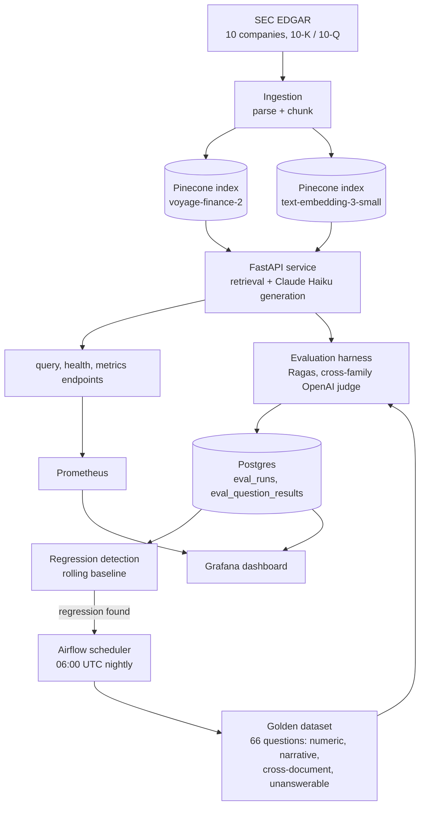
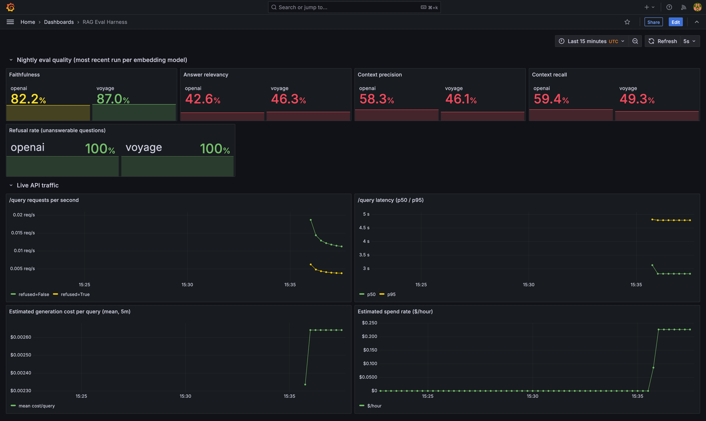
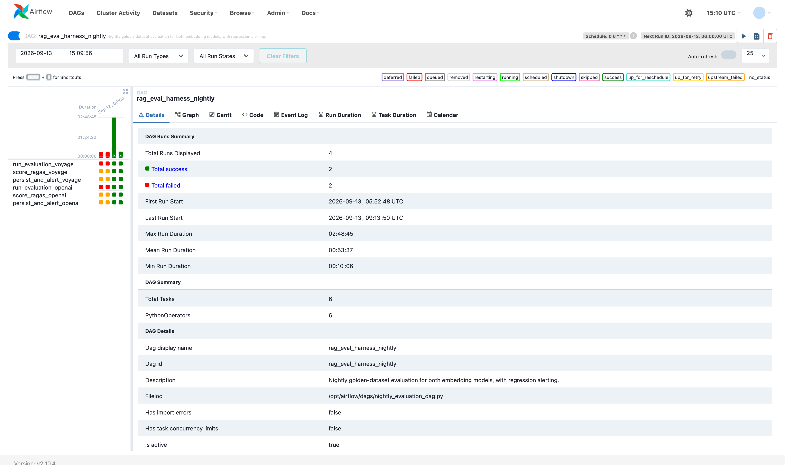
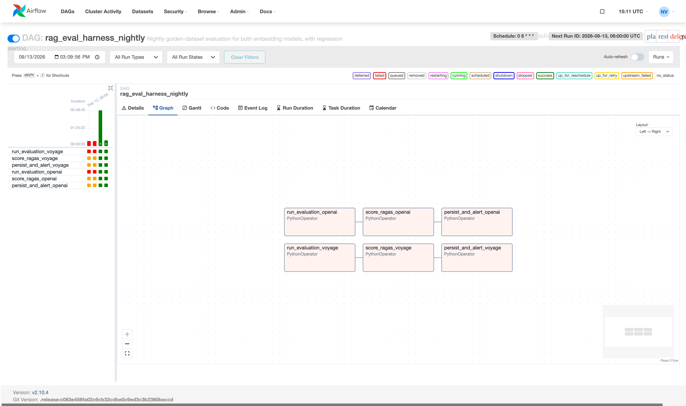
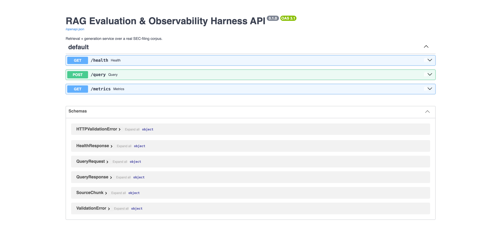

# RAG Evaluation & Observability Harness

[](https://github.com/NandakumarVuppalapati/rag-eval-harness/actions/workflows/ci.yml)

Production RAG systems rarely have a good answer to the question *"how do you know when it's wrong?"* Retrieval can quietly start missing the right passages. Generation can hallucinate fluently, without throwing a single error. Neither shows up in a normal API status code.

This project is a harness that continuously interrogates a real RAG system — instead of just running it — to answer that question with evidence instead of guesswork.

## What it does

A RAG pipeline answers financial-research questions by retrieving passages from a real corpus of public SEC filings (10-K / 10-Q, 10 companies) and generating grounded answers over them with Claude. Separately, a 66-question golden evaluation dataset — numeric questions grounded in XBRL structured data, narrative questions verified against the actual filing text, cross-document comparisons, and deliberately unanswerable questions that should be refused — is run against that pipeline, scored with [Ragas](https://github.com/explodinggradients/ragas) on faithfulness, answer relevancy, context precision/recall, and refusal rate, and the results are persisted so quality can be tracked over time and regressions can be flagged automatically, before a user notices them.

## Why these design choices

- **Domain-specific embeddings, benchmarked against a general-purpose baseline.** The primary embedding model is Voyage AI's `voyage-finance-2`, trained specifically on financial text; `text-embedding-3-small` runs alongside it as a documented baseline so the retrieval-quality delta between domain-tuned and general-purpose embeddings is measured, not assumed.
- **Cross-family LLM judging.** Generation uses Claude Haiku; the Ragas evaluation judge uses a different model family (OpenAI `gpt-4o-mini`) to avoid the self-preference bias that comes from a model grading its own answers.
- **A golden dataset that includes questions it should refuse.** 11 of the 66 questions are deliberately unanswerable from this corpus (wrong company, wrong period, hypothetical, undisclosed metric). Refusing them correctly is scored as its own metric, separate from Ragas's answer-quality metrics, which all assume a correct answer exists.
- **Real infrastructure, cost-bounded deliberately.** Every API call in this project is real (no mocked demo data) — but model choice, dataset size, and caching are all tuned to keep this genuinely cheap to run, documented in [`docs/adr/`](docs/adr/).

## Architecture



| Component | What it is |
|---|---|
| `src/rag_eval_harness/ingestion/` | Pulls real 10-K/10-Q filings from SEC EDGAR, parses and chunks them, embeds with both models, indexes into two Pinecone indexes |
| `src/rag_eval_harness/retrieval/` + `generation/` | Retrieval + Claude-Haiku generation over the indexed corpus |
| `src/rag_eval_harness/api/` | FastAPI service exposing `/query`, `/health`, and a Prometheus `/metrics` endpoint |
| `data/golden_dataset/` | The 66-question hand-curated evaluation set (numeric, narrative, cross-document, unanswerable) |
| `src/rag_eval_harness/evaluation/` | Runs the golden dataset through the pipeline and scores it with Ragas (cross-family judge) |
| `src/rag_eval_harness/observability/` | Persists every run (Postgres/SQLite via SQLAlchemy Core) and detects regressions against rolling history |
| `dags/nightly_evaluation_dag.py` | Airflow DAG: runs the evaluation nightly for both embedding models, persists results, fails loudly on regression |
| `docker/` | `docker-compose.yml` wiring Postgres, the API, Prometheus, Grafana, and Airflow (webserver + scheduler, `LocalExecutor`) |

Design rationale for each of these lives in [`docs/adr/`](docs/adr/) as the project is built.

## Running it locally

```bash
cp .env.example .env   # fill in real OPENAI_API_KEY / ANTHROPIC_API_KEY / VOYAGE_API_KEY / PINECONE_API_KEY
docker compose -f docker/docker-compose.yml up -d --build
```

This brings up:

- the API at `http://localhost:8000` (`/query`, `/health`, `/metrics`)
- Prometheus at `http://localhost:9090`, scraping the API every 15s
- Grafana at `http://localhost:3000` (default `admin` / `admin`), pre-provisioned with a dashboard covering the most recent nightly eval scores per embedding model plus live request rate, latency, and estimated cost
- the Airflow UI at `http://localhost:8080` (same default credentials), scheduled to run `rag_eval_harness_nightly` at 06:00 UTC

Without Docker, `scripts/run_evaluation.py` and `scripts/load_eval_results.py` can be run directly against a local SQLite file — see their `--help` output.

### Screenshots

All from the real, running local stack (not staged/mocked) — a live triggered `rag_eval_harness_nightly` run that completed successfully end to end, for a real API cost of $0.6781.

**Grafana — nightly eval quality + live API traffic**



Per-model Ragas scores (openai vs. voyage): faithfulness 82.2% / 87.0%, answer relevancy 42.6% / 46.3%, context precision 58.3% / 46.1%, context recall 59.4% / 49.3%, refusal rate on unanswerable questions 100% / 100%. The "Live API traffic" row scrapes the FastAPI service's own `/metrics` endpoint every 15s via Prometheus; the visible spike is 7 real `/query` requests (a mix of numeric and narrative golden-dataset questions, split across both embedding models, one deliberately unanswerable one included) sent directly at the running API to prove the panels aren't just wired up but actually move — real cost: $0.0185.

**Airflow — DAG run history**



2 successful runs (max duration 2:48:45 — driven by real OpenAI rate-limit backoff during Ragas judging, not a bug) and 2 failed pre-fix catchup runs, kept visible rather than cleared, as an honest record of the debugging process below.

<details>
<summary><strong>More screenshots</strong> — DAG dependency graph, live API docs</summary>

<br>

**Airflow — DAG dependency graph**, both embedding-model branches running in parallel:



**FastAPI — live, auto-generated API docs** at `/docs`, reflecting the real Pydantic request/response models:



</details>

## Real deployment bugs, found and fixed

Getting the full Docker Compose stack (Postgres, the API, Prometheus, Grafana, Airflow webserver + scheduler) to actually complete a live nightly run — instead of just passing CI — surfaced four real bugs that CI's own checks couldn't see, because none of them build and run the Airflow image end to end:

1. **SQLAlchemy version conflict.** The project's own `sqlalchemy>=2.0` floor conflicted with Airflow 2.10.4's tested `1.4.54`, crashing the webserver and scheduler with a `MappedAnnotationError` on boot. Fixed by lowering the floor to `>=1.4` and pinning Airflow's own SQLAlchemy family via a constraints file trimmed to just that package group ([`1eab607`](https://github.com/NandakumarVuppalapati/rag-eval-harness/commit/1eab607), [`1165580`](https://github.com/NandakumarVuppalapati/rag-eval-harness/commit/1165580), [`11f8588`](https://github.com/NandakumarVuppalapati/rag-eval-harness/commit/11f8588)).
2. **pandas version conflict**, found while fixing the one above: `pandas>=2.2` clashed with Airflow's own `pandas==2.1.4` constraint. Fixed by lowering the floor to `>=2.1` ([`d86e327`](https://github.com/NandakumarVuppalapati/rag-eval-harness/commit/d86e327)).
3. **Wrong-location import.** `run_for_embedding_model` lived in `scripts/`, which `docker/airflow.Dockerfile` never copies into the image — invisible to CI's `py_compile`-only DAG check, and only caught by watching a live triggered run fail with `ModuleNotFoundError`. Fixed by moving the function into the package that actually gets `pip install`ed ([`2bf02e5`](https://github.com/NandakumarVuppalapati/rag-eval-harness/commit/2bf02e5)), which then surfaced a real `mypy` type mismatch the moment it entered the one directory CI type-checks ([`f7a95e8`](https://github.com/NandakumarVuppalapati/rag-eval-harness/commit/f7a95e8)).
4. **Wrong-location data path.** `harness.py` computed its golden-dataset directory as four parents up from `__file__` — correct for an editable/source install, but a real `pip install .` (what the Docker image does) copies the file into `site-packages` and breaks that math, throwing `FileNotFoundError` for a dataset that was actually mounted, just not where the guess landed. Fixed with an explicit `GOLDEN_DATASET_DIR` env override set in `docker-compose.yml` ([`512cb09`](https://github.com/NandakumarVuppalapati/rag-eval-harness/commit/512cb09)).

Each fix was verified against a from-scratch venv simulation mirroring the real image's dependency resolution *before* being pushed, not just re-run through CI — because CI genuinely couldn't have caught any of these four.

## Status

Working end to end: real ingestion from SEC EDGAR, retrieval + generation over two live Pinecone indexes, the full 66-question golden dataset scored with real Ragas judge calls, Postgres-backed observability, and CI (lint, type-check, tests) green on every push. See [`docs/adr/`](docs/adr/) and the commit history for how it got here, including the real bugs found along the way.

What's next, in rough priority order:
- `parsing.py` and `chunking.py` now have fixture-based unit tests (real trimmed excerpts of an actual Apple 10-Q, see `tests/fixtures/`); `embed_and_index.py` and `sec_edgar.py` are still exercised only end-to-end by the real corpus, not unit-tested, since both are thin wrappers around real network calls (Pinecone upsert, SEC EDGAR fetch) that would need to be mocked to test in isolation.
- A third embedding model in the comparison (the current two-way voyage-finance-2 vs. text-embedding-3-small result is real but only a two-point comparison).
- Cost and latency as their own regression-tracked metrics alongside the Ragas quality scores, since those are what actually pages someone in a real deployment.

## License

MIT — see [LICENSE](LICENSE).
