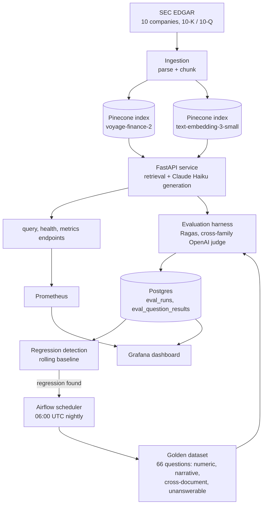

# RAG Evaluation & Observability Harness

Production RAG systems rarely have a good answer to the question *"how do you know when it's wrong?"* Retrieval can quietly start missing the right passages. Generation can hallucinate fluently, without throwing a single error. Neither shows up in a normal API status code.

This project is a harness that continuously interrogates a real RAG system — instead of just running it — to answer that question with evidence instead of guesswork.

## What it does

A RAG pipeline answers financial-research questions by retrieving passages from a real corpus of public SEC filings (10-K / 10-Q, 10 companies) and generating grounded answers over them with Claude. Separately, a 66-question golden evaluation dataset — numeric questions grounded in XBRL structured data, narrative questions verified against the actual filing text, cross-document comparisons, and deliberately unanswerable questions that should be refused — is run against that pipeline, scored with [Ragas](https://github.com/explodinggraph/ragas) on faithfulness, answer relevancy, context precision/recall, and refusal rate, and the results are persisted so quality can be tracked over time and regressions can be flagged automatically, before a user notices them.

## Why these design choices

- **Domain-specific embeddings, benchmarked against a general-purpose baseline.** The primary embedding model is Voyage AI's `voyage-finance-2`, trained specifically on financial text; `text-embedding-3-small` runs alongside it as a documented baseline so the retrieval-quality delta between domain-tuned and general-purpose embeddings is measured, not assumed.
- **Cross-family LLM judging.** Generation uses Claude Haiku; the Ragas evaluation judge uses a different model family (OpenAI `gpt-4o-mini`) to avoid the self-preference bias that comes from a model grading its own answers.
- **A golden dataset that includes questions it should refuse.** 11 of the 66 questions are deliberately unanswerable from this corpus (wrong company, wrong period, hypothetical, undisclosed metric). Refusing them correctly is scored as its own metric, separate from Ragas's answer-quality metrics, which all assume a correct answer exists.
- **Real infrastructure, cost-bounded deliberately.** Every API call in this project is real (no mocked demo data) — but model choice, dataset size, and caching are all tuned to keep this genuinely cheap to run, documented in [`docs/adr/`](docs/adr/).

## Architecture



| Component | What it is |
|---|---|
| `src/rag_eval_harness/ingestion/` | Pulls real 10-K/10-Q filings from SEC EDGAR, parses and chunks them, embeds with both models, indexes into two Pinecone indexes |
| `src/rag_eval_harness/retrieval/` + `generation/` | Retrieval + Claude-Haiku generation over the indexed corpus |
| `src/rag_eval_harness/api/` | FastAPI service exposing `/query`, `/health`, and a Prometheus `/metrics` endpoint |
| `data/golden_dataset/` | The 66-question hand-curated evaluation set (numeric, narrative, cross-document, unanswerable) |
| `src/rag_eval_harness/evaluation/` | Runs the golden dataset through the pipeline and scores it with Ragas (cross-family judge) |
| `src/rag_eval_harness/observability/` | Persists every run (Postgres/SQLite via SQLAlchemy Core) and detects regressions against rolling history |
| `dags/nightly_evaluation_dag.py` | Airflow DAG: runs the evaluation nightly for both embedding models, persists results, fails loudly on regression |
| `docker/` | `docker-compose.yml` wiring Postgres, the API, Prometheus, Grafana, and Airflow (webserver + scheduler, `LocalExecutor`) |

Design rationale for each of these lives in [`docs/adr/`](docs/adr/) as the project is built.

## Running it locally

```bash
cp .env.example .env   # fill in real OPENAI_API_KEY / ANTHROPIC_API_KEY / VOYAGE_API_KEY / PINECONE_API_KEY
docker compose -f docker/docker-compose.yml up -d --build
```

This brings up:

- the API at `http://localhost:8000` (`/query`, `/health`, `/metrics`)
- Prometheus at `http://localhost:9090`, scraping the API every 15s
- Grafana at `http://localhost:3000` (default `admin` / `admin`), pre-provisioned with a dashboard covering the most recent nightly eval scores per embedding model plus live request rate, latency, and estimated cost
- the Airflow UI at `http://localhost:8080` (same default credentials), scheduled to run `rag_eval_harness_nightly` at 06:00 UTC

Without Docker, `scripts/run_evaluation.py` and `scripts/load_eval_results.py` can be run directly against a local SQLite file — see their `--help` output.

## Status

This project is under active development. See the commit history for progress.

## License

MIT — see [LICENSE](LICENSE).
